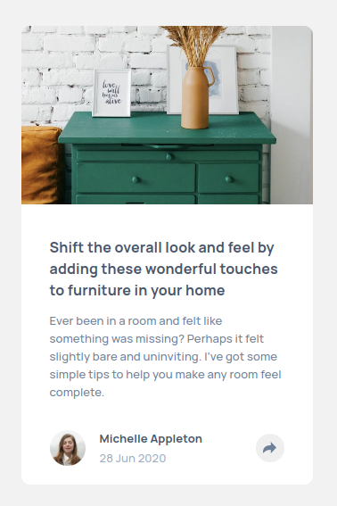
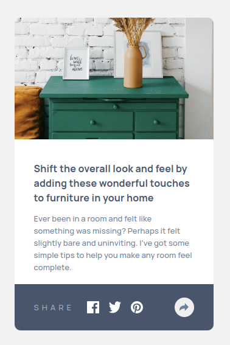
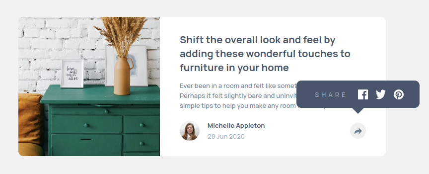

# Frontend Mentor - Article preview component solution

This is a solution to the [Article preview component challenge on Frontend Mentor](https://www.frontendmentor.io/challenges/article-preview-component-dYBN_pYFT). Frontend Mentor challenges help you improve your coding skills by building realistic projects. 

## Table of contents

- [Overview](#overview)
  - [The challenge](#the-challenge)
  - [Screenshot](#screenshot)
  - [Links](#links)
- [My process](#my-process)
  - [Built with](#built-with)
  - [What I learned](#what-i-learned)
  - [Continued development](#continued-development)
  - [Useful resources](#useful-resources)
- [Author](#author)
- [Acknowledgments](#acknowledgments)

## Overview

### The challenge

Users should be able to:

- View the optimal layout for the component depending on their device's screen size
- See the social media share links when they click the share icon

### Screenshot

### Links

- Solution URL: [Article Preview](https://www.frontendmentor.io/solutions/article-preview-MwMmnnawQ7)
- Live Site URL: [Article Preview](https://frontendmentor-gonzalotejada.netlify.app/article-preview/)

## My process

### Built with

- Semantic HTML5 markup
- Flexbox
- Mobile-first workflow

### What I learned

I learned how to create the bottom triangle used in the tooltip. I might have used it in the past but I didn't recall. I also learned how to use the `checkVisibility()` function from the HTML Elements.

### Continued development

I need to learn more about tooltips and how to render them. I mean, I'll like the code associated to tooltips not really in the dom until it's needed. I know how to do it but not sure it it's too much overhead.

### Useful resources

- [checkVisibility](https://developer.mozilla.org/en-US/docs/Web/API/Element/checkVisibility) - Helped me to check if an element is visible or not, using JavaScript.

## Author

- Frontend Mentor - [@vgt3j4d4](https://www.frontendmentor.io/profile/vgt3j4d4)

## Acknowledgments

None.
