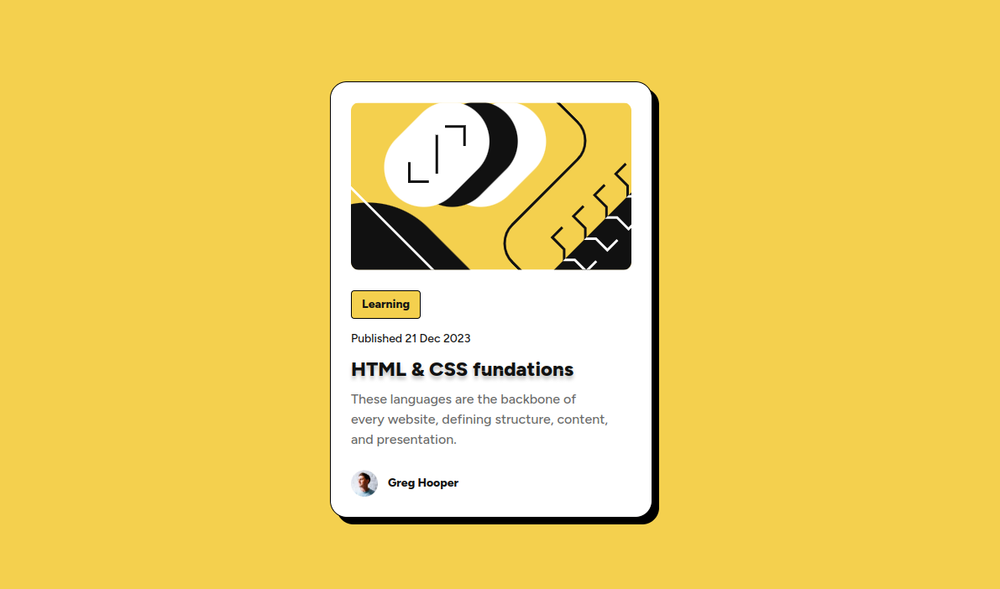

# Frontend Mentor - Blog preview card

### Screenshot

- Solution URL: [Add solution URL here](https://github.com/vgt3j4d4/frontendmentor/tree/main/challenges/blog-preview-card)
- Live Site URL: [Add live site URL here](https://frontendmentor-gonzalotejada.netlify.app/blog-preview-card/)

## My process

### Built with

- Semantic HTML5 markup
- Sass
- Flexbox

**Note: These are just examples. Delete this note and replace the list above with your own choices**

### What I learned

- A bit of animations
- text-shadow

### Continued development

- Need to learn css animations

### Useful resources

- [CSS text-shadow Property](https://www.w3schools.com/cssref/css3_pr_text-shadow.php)
