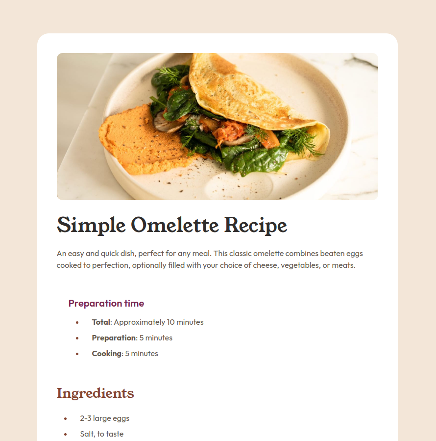

# Frontend Mentor - Recipe page solution

This is a solution to the [Recipe page challenge on Frontend Mentor](https://www.frontendmentor.io/challenges/recipe-page-KiTsR8QQKm). Frontend Mentor challenges help you improve your coding skills by building realistic projects.

## Table of contents

- [Overview](#overview)
  - [The challenge](#the-challenge)
  - [Screenshot](#screenshot)
  - [Links](#links)
- [My process](#my-process)
  - [Built with](#built-with)
  - [What I learned](#what-i-learned)
  - [Continued development](#continued-development)
  - [Useful resources](#useful-resources)
- [Author](#author)
- [Acknowledgments](#acknowledgments)

## Overview

### Screenshot

**Note: Delete this note and the paragraphs above when you add your screenshot. If you prefer not to add a screenshot, feel free to remove this entire section.**

### Links

- Solution URL: [Recipe Page](https://github.com/vgt3j4d4/frontendmentor/tree/main/challenges/recipe-page)
- Live Site URL: [Recipe Page](https://frontendmentor-gonzalotejada.netlify.app/recipe-page)

## My process

### Built with

- Semantic HTML5 markup
- Flexbox
- Mobile-first workflow

### What I learned

- `<picture>` element
- `` object-fit css property
- How to style a `
` element
- `<table>` border-collapse css property

### Continued development

- Accessibility

### Useful resources

- [axe Accessibility Linter](https://marketplace.visualstudio.com/items?itemName=deque-systems.vscode-axe-linter) - Helps you find accessibility issues in your code.
- [Supermaven](https://marketplace.visualstudio.com/items?itemName=supermaven.supermaven) - Just helps me anticipating the code I'm going to write.

## Author

- Frontend Mentor - [@vgt3j4d4](https://www.frontendmentor.io/profile/vgt3j4d4)
