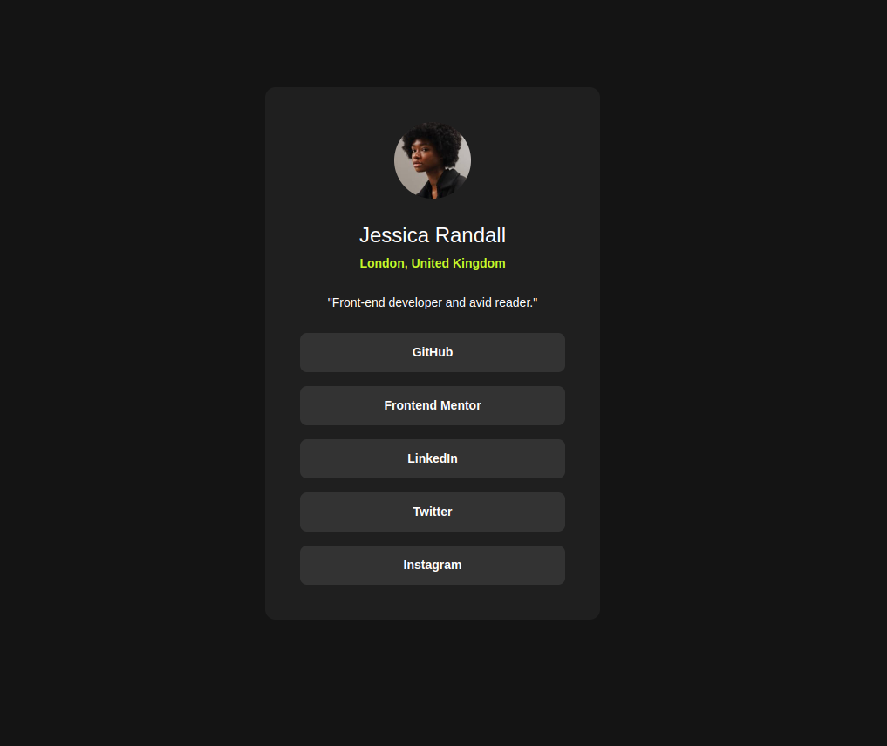

# Frontend Mentor - Social links profile solution

This is a solution to the [Social links profile challenge on Frontend Mentor](https://www.frontendmentor.io/challenges/social-links-profile-UG32l9m6dQ). Frontend Mentor challenges help you improve your coding skills by building realistic projects. 

## Table of contents

- [Overview](#overview)
  - [The challenge](#the-challenge)
  - [Screenshot](#screenshot)
  - [Links](#links)
- [My process](#my-process)
  - [Built with](#built-with)
  - [What I learned](#what-i-learned)
  - [Continued development](#continued-development)
  - [Useful resources](#useful-resources)
- [Author](#author)
- [Acknowledgments](#acknowledgments)

**Note: Delete this note and update the table of contents based on what sections you keep.**

## Overview

### The challenge

Users should be able to:

- See hover and focus states for all interactive elements on the page

### Screenshot

### Links

- Solution URL: [Social Links Profile](https://github.com/vgt3j4d4/frontendmentor/tree/main/challenges/social-links-profile)
- Live Site URL: [Social Links Profile](https://frontendmentor-gonzalotejada.netlify.app/social-links-profile/)

## My process

### Built with

- Semantic HTML5 markup
- Sass
- Flexbox
- Mobile-first workflow

### What I learned

Not much.

### Continued development

Well, I still need to learn more about CSS animations.

### Useful resources

## Author

- Frontend Mentor - [@vgt3j4d4](https://www.frontendmentor.io/profile/vgt3j4d4)

## Acknowledgments
