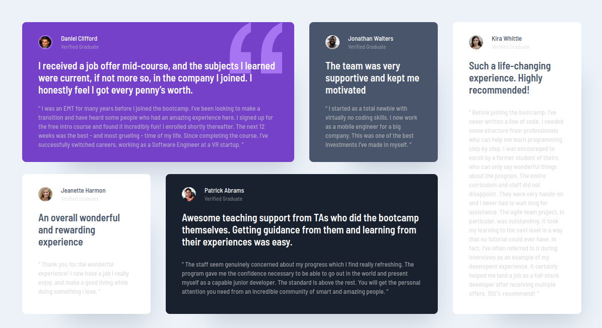

# Frontend Mentor - Testimonials grid section solution

This is a solution to the [Testimonials grid section challenge on Frontend Mentor](https://www.frontendmentor.io/challenges/testimonials-grid-section-Nnw6J7Un7). Frontend Mentor challenges help you improve your coding skills by building realistic projects.

## Table of contents

- [Overview](#overview)
  - [The challenge](#the-challenge)
  - [Screenshot](#screenshot)
  - [Links](#links)
- [My process](#my-process)
  - [Built with](#built-with)
  - [What I learned](#what-i-learned)
  - [Continued development](#continued-development)
  - [Useful resources](#useful-resources)
- [Author](#author)
- [Acknowledgments](#acknowledgments)

## Overview

### The challenge

Users should be able to:

- View the optimal layout for the site depending on their device's screen size

### Screenshot



### Links

- Solution URL: [Solution URL](https://www.frontendmentor.io/solutions/testimonial-grid-section-G15UKU7NUk)
- Live Site URL: [Live Site URL](https://frontendmentor-gonzalotejada.netlify.app/testimonials-grid-section/)

## My process

### Built with

- Semantic HTML5 markup
- CSS Grid
- Mobile-first workflow

### What I learned

I remembered how to position background images:

From styles.scss:

```
&.testimonial-daniel {
    background-color: $color-moderate-violet;
    background-image: url("../images/bg-pattern-quotation.svg");
    background-repeat: no-repeat;
    background-position: top right rem(24);
}
```

### Continued development

I'll keep reviewing css grid and try to learn more about it.

### Useful resources

- [Interactive Guide to Grid](https://www.joshwcomeau.com/css/interactive-guide-to-grid/) - My go to resource for refreshing CSS Grid knowledge.

## Author

- Frontend Mentor - [@vgt3j4d4](https://www.frontendmentor.io/profile/vgt3j4d4)
